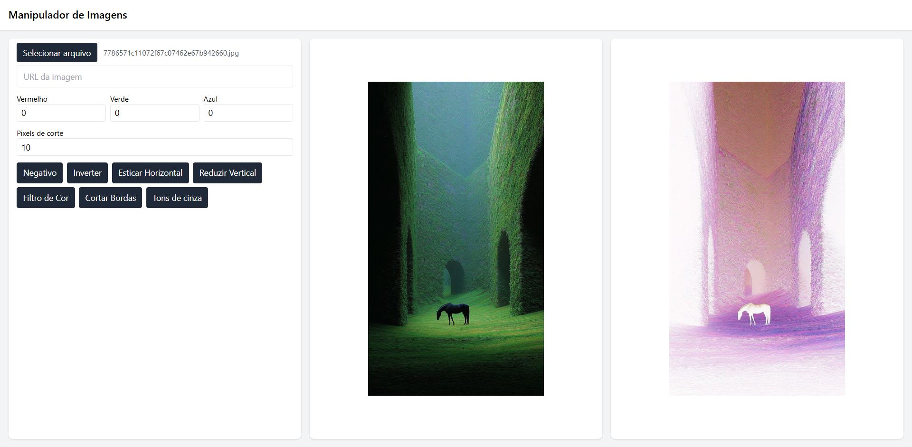

# Manipulador de Imagens

Aplicação web para manipulação de imagens. Permite fazer upload de uma imagem, aplicar filtros de processamento (negativo, inversão, alongamento horizontal, redução vertical, filtro de cor, corte de bordas) e baixar a imagem processada.

## Tecnologias
- **Front-end**: React 18, TypeScript, Vite, Tailwind CSS
- **Back-end**: Java 21, HttpServer (sem frameworks externos)
- **Deploy**: GitHub Pages (front-end), servidor local/remoto (back-end)

## Demo
- 🌐 [Abrir Demo](https://amazing-site.netlify.app/) (substitua pela URL do Netlify após deploy)
- 📱 Interface responsiva para desktop e mobile

## Preview


## Funcionalidades
- 📤 Upload de imagens (via arquivo ou URL)
- 🎨 Aplicação de filtros:
  - Negativo
  - Inversão de cores
  - Alongamento horizontal
  - Redução vertical
  - Filtro de cor (RGB)
  - Corte de bordas
- 💾 Download da imagem processada
- 🔄 Processamento em tempo real

## Estrutura do Projeto
```
manipulador-de-imagens/
├── back-end/                 # Servidor Java
│   ├── src/main/java/image/processing/
│   │   ├── SimpleImageServer.java  # Servidor HTTP
│   │   ├── ImageProcessor.java     # Lógica de processamento
│   │   └── ImageUtils.java         # Utilitários de imagem
│   └── pom.xml                     # Configuração Maven
├── front-end/                # Aplicação React
│   ├── src/
│   │   ├── App.tsx           # Componente principal
│   │   ├── api.ts            # Cliente API
│   │   └── ...
│   ├── package.json
│   └── vite.config.ts
├── docs/                     # Documentação e imagens
└── README.md
```

## Pré-requisitos
- Java 21 (JDK)
- Maven 3.9+
- Node.js 18+
- Git

## Como Executar Localmente

### Back-end
```bash
cd back-end
mvn clean compile
mvn exec:java
```
O servidor iniciará em `http://localhost:8080`

### Front-end
```bash
cd front-end
npm install
npm run dev
```
A aplicação estará disponível em `http://localhost:5173`

## API Endpoints
- `GET /api/health` - Verificação de saúde
- `POST /api/process/negative` - Aplicar filtro negativo
- `POST /api/process/invert` - Inverter cores
- `POST /api/process/stretch-h` - Alongar horizontalmente
- `POST /api/process/shrink-v` - Reduzir verticalmente
- `POST /api/process/color-filter?red=X&green=Y&blue=Z` - Filtro de cor
- `POST /api/process/trim?pixelCount=N` - Cortar bordas
- `POST /api/process/grayscale` - Converter para escala de cinza

**Parâmetros**: Envie a imagem como corpo da requisição POST (multipart/form-data) ou via query `imageUrl` para URL.

## Deploy

### Front-end (Netlify)
1. Acesse [netlify.com](https://netlify.com) e crie uma conta.
2. Clique em "Add new site" > "Import an existing project".
3. Conecte seu repositório GitHub (`leonardo-dos-santos/manipulador-de-imagens`).
4. Configure:
   - **Branch**: `main`
   - **Build command**: `npm ci && npm run build`
   - **Publish directory**: `front-end/dist`
5. Adicione variável de ambiente: `VITE_API_BASE_URL` com a URL do back-end remoto (ex.: `https://manipulador-backend.onrender.com`).
6. Clique em "Deploy site".
7. Após o deploy, copie a URL gerada (ex.: `https://amazing-site.netlify.app`).

### Back-end (Render - Gratuito)
1. Acesse [render.com](https://render.com) e crie uma conta.
2. Clique em "New" > "Web Service".
3. Conecte seu repositório GitHub (`leonardo-dos-santos/manipulador-de-imagens`).
4. Configure:
   - **Branch**: `main`
   - **Root Directory**: `back-end`
   - **Build Command**: `mvn clean package`
   - **Start Command**: `mvn exec:java -Dexec.mainClass="image.processing.SimpleImageServer"`
5. Clique em "Create Web Service".
6. Aguarde o deploy e copie a URL gerada (ex.: `https://manipulador-backend.onrender.com`).
7. Atualize a variável `VITE_API_BASE_URL` no Netlify com essa URL.

## Desenvolvimento
- **Back-end**: Maven para build e execução
- **Front-end**: Vite para desenvolvimento rápido com HMR
- **CORS**: Configurado para desenvolvimento local

## Contribuição
1. Fork o projeto
2. Crie uma branch para sua feature (`git checkout -b feature/nova-feature`)
3. Commit suas mudanças (`git commit -m 'Adiciona nova feature'`)
4. Push para a branch (`git push origin feature/nova-feature`)
5. Abra um Pull Request

## Licença
Este projeto é open-source. Sinta-se à vontade para usar e modificar.
